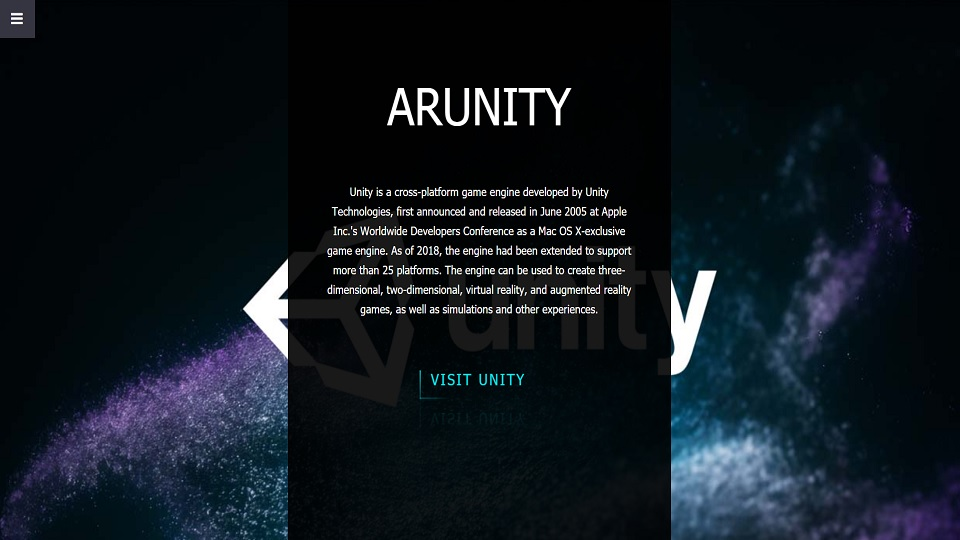
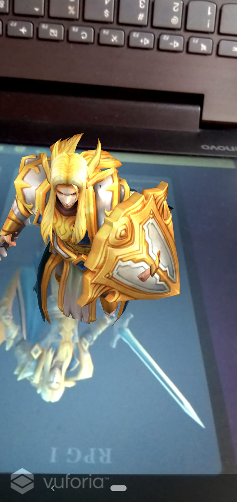
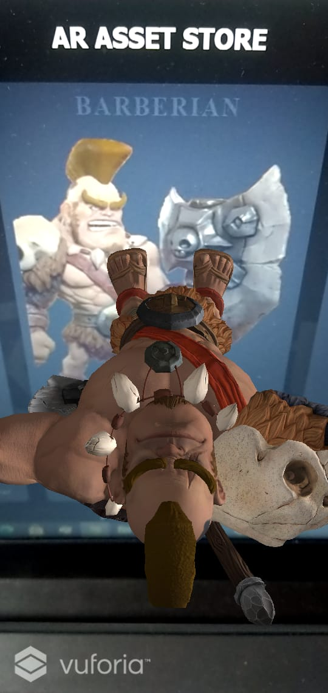

<h1>ARUnity</h1>
<h2>Problem Statement</h2>

To get a better visuals of the 3D models, without importing them to your system, for unity game developers for free. Which will lead to a better memory/ storage utilization. 

<h2>My Solution - ModAR</h2>

An Augmented Reality based system wherein game developers would be able to observe 3D models of various characters. This can be done with the help of combination of a website and a mobile app. ARAsset Store is added in the website. On selecting the ARAsset Store, the website would display image of that particular model. These images can be scanned by our custom mobile application which would immediately augment a 3D model of those images. These models can be observed from any angle by rotating our phone and the information provided by the website would aid in better understanding of the same asset.

<h2>Technology Stack</h2>
Following is the technology stack for:

* Website - HTML, CSS, Javascript
* App - Unity 3D, vuforia sdk

<h2>Navigation</h2>
Following are the navigations for:

* / - contains the code of the website
* app/ - contains the apk file of the app
* media/ - conatins banner image and results

<h2>Steps to Install and Run the Project</h2>
* Open ARUnity website on your Laptop (https://moreharsh.github.io/ARUnity/).
* Go to AR ASSET STORE.
* Visit https://github.com/moreharsh/ARUnity-Apk and download and install the ARUnity.apk file on your android device.
* Open the installed ARUnity.apk file on your android device.
* Scan the indivisual Assets from the website with the help of andorid app.

For the project to work, the website and the app have to work simultaneously.

<h2>Website</h2>
Website can be visited by clicking the above link. Any subtopic from the home page can be chosen to see it's 3D illustration. Please visit the website using laptop or PC for smooth functioning of the project.

<h3>App</h3>
App can be installed with the help of the APK file which is present inside the app/ directory.  
 
The subtopic which was chosen in the website has to be chosen in the app as well, after which a scanner will get opened. On scanning the images from the website with the help of the app scanner, 3D models of images will get Augmented on them and thus will be seen through the app. 

<h3>Results</h3>

<h3>GitHub Link: </h3> <a href="https://github.com/more-harsh/ARUnity"> https://github.com/more-harsh/ARUnity </a>
